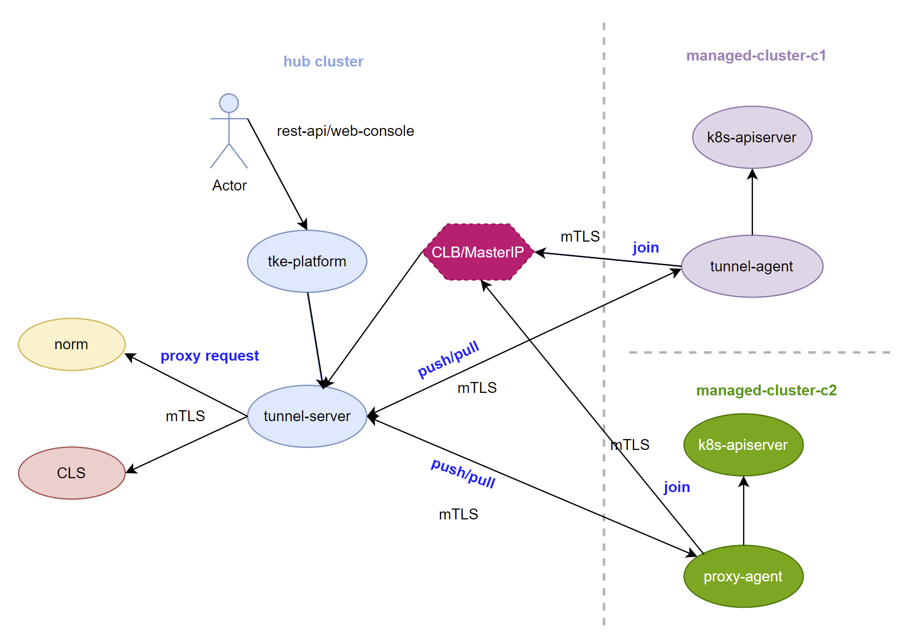

# tke-anp-tunnel

This repo aim to leverage Open Source project [ANP](https://github.com/kubernetes-sigs/apiserver-network-proxy/) and  [Yurt](https://github.com/openyurtio/openyurt/) to enable communication between global/mate cluster and managed cluster by a reverse tunnel for `multi cloud` solution

## tke-anp-tunnel VS openyurt

1. Add reverse proxy to tunnel server so that `agent` add `add-on` service placed in managed cluster is able to access the service(such as norm) which in same flat network with tunnel server, with it,  `tke-anp-tunnel` support both `pull` and `push` mode.

2. Enhance certificate management, the tunnel server/agent certificate managed by global/mate cluster apiserver by `CSR` and support certificate rotation.

3. Enhance the deploy topology：
 - Support **1** tunnel server works for **N** tunnel agent and **1** tunnel server works for **1** tunnel  agent for `public` cloud case and `private` cloud case
 - No `hostNetwork` dependency
 - Only tunnel server **MUST** exposed to the public network for agent join

4. Add hook plug-in mechanism/interface to execute customized logic for supporting different user case

## Architecture



## Build & Push image

1. Update image repo for your own
```
export REPO=huxl
```
2. Build and push docker image to docker hub
```
export REGION=cn && make release
```

## Deploy  topology  1: N

1. Deploy tunnel server on global/meta cluster

```
kubectl label nodes <node-name> openyurt.io/is-edge-worker=false
kubectl  create -f config/setup/yurt-tunnel-server.yaml
```

2. Deploy tunnel agent on managed cluster

```
kubectl  create -f config/setup/yurt-tunnel-agent.yaml
```

## Tunnel test

The `Managed cluster` doesn't have `inbound` network,  so `Hub cluster` can't access to `Managed cluster` directly for communication, but it has `outbound` network which can access to tunnel sever to setup a reverse tunnel , then `Managed cluster` is able to communicate to `Hub cluster` by  this tunnel.  The test client will leverage [ANP client](https://github.com/kubernetes-sigs/apiserver-network-proxy/tree/master/cmd/client) to verify tunnel works as excepted. To simplified the verification test case ,  the tunnel server and tunnel client are deployed to same pod and use same crt/key pairs to enable mTLS based communication

`Hub cluster`:  

```
root@VM-0-80-ubuntu:~# kubectl get node
NAME         STATUS   ROLES    AGE     VERSION
10.0.0.80    Ready    master   4d10h   v1.19.7
root@VM-0-80-ubuntu:~#
```

`Managed cluster`:

```
root@VM-0-77-ubuntu:~# kubectl get node
NAME          STATUS   ROLES    AGE    VERSION
172.22.0.77   Ready    master   4d9h   v1.19.7
root@VM-0-77-ubuntu:~# 
```

### case 1:  HTTP-Connect client using mTLS Proxy with dial back Agent to Python based SimpleHTTPServer

```
client =HTTP-CONNECT=> (:10263) proxy (:10262) <=GRPC= agent =HTTP=> SimpleHTTPServer(:8000)
  |                                                    ^
  |                          Tunnel                    |
  +----------------------------------------------------+
```

1.  Check the tunnel server and tunnel agent both in `Running` and ready to use

```
root@VM-0-80-ubuntu:~# kubectl get po -A |grep tunn
kube-system   yurt-tunnel-server-7854c5c54f-n4nbp        1/1     Running   1          151m
root@VM-0-77-ubuntu:~# kubectl get po -A |grep tunn
kube-system   yurt-tunnel-agent-7597c6dd89-ncg52         1/1     Running   0          81m
root@VM-0-77-ubuntu:~# 
```

2.  Run python based HTTP server on managed cluster  

```
root@VM-0-77-ubuntu:~# python -m SimpleHTTPServer
Serving HTTP on 0.0.0.0 port 8000 ...
```

3.   Update `-cluster-name`to the SimpleHTTPServer ip address which identified the managed cluster name and re-deploy tunnel agent

```
root@VM-0-77-ubuntu:~/mcm/yurt# git diff -u yurt-tunnel-agent.yaml yurt-tunnel-agent.yaml.bak
diff --git a/yurt-tunnel-agent.yaml b/yurt-tunnel-agent.yaml.bak
index bbd359e..c853755 100644
--- a/yurt-tunnel-agent.yaml
+++ b/yurt-tunnel-agent.yaml.bak
@@ -26,7 +26,7 @@ spec:
       - command:
         - yurt-tunnel-agent
         args:
-        - --cluster-name=cls-t8gz6mgd
+        - --cluster-name=172.22.0.77
         - --apiserver-addr=132.232.31.102:31501
         - --tunnelserver-addr=132.232.31.102:31502
         - --v=4
root@VM-0-77-ubuntu:~/mcm/yurt# 
```

4.  Copy client binary to tunnel server 

```
kubectl cp yurt-tunnel-client `kubectl get po -l k8s-app=yurt-tunnel-server -n kube-system -o jsonpath="{.items[0].metadata.name}"`:/ -n kube-system
```

5.  Run client to get SimpleHTTPServer response by tunnel

```
root@VM-0-80-ubuntu:~# kubectl exec -it `kubectl get po  -l k8s-app=yurt-tunnel-server -n kube-system -o jsonpath="{.items[0].metadata.name}"` -n kube-system sh
kubectl exec [POD] [COMMAND] is DEPRECATED and will be removed in a future version. Use kubectl exec [POD] -- [COMMAND] instead.
/ # ./yurt-tunnel-client --ca-cert=/run/secrets/kubernetes.io/serviceaccount/ca.crt --client-cert=/v
ar/lib/yurttunnel-server/pki/yurttunnel-server-current.pem    --client-key=./var/lib/yurttunnel-serv
er/pki/yurttunnel-server-current.pem  --proxy-host=132.232.31.102  --proxy-port=31503 --mode=http-co
nnect  --request-host=172.22.0.77  --request-port=8000 --request-path=""
I0228 23:40:17.032519     122 client.go:106] ClientCert set to "/var/lib/yurttunnel-server/pki/yurttunnel-server-current.pem".
I0228 23:40:17.032555     122 client.go:107] ClientKey set to "./var/lib/yurttunnel-server/pki/yurttunnel-server-current.pem".
I0228 23:40:17.032570     122 client.go:108] CACert set to "/run/secrets/kubernetes.io/serviceaccount/ca.crt".
I0228 23:40:17.032580     122 client.go:109] RequestProto set to "http".
I0228 23:40:17.032589     122 client.go:110] RequestPath set to "".
I0228 23:40:17.032598     122 client.go:111] RequestHost set to "172.22.0.77".
I0228 23:40:17.032607     122 client.go:112] RequestPort set to 8000.
I0228 23:40:17.032619     122 client.go:113] ProxyHost set to "132.232.31.102".
I0228 23:40:17.032633     122 client.go:114] ProxyPort set to 31503.
I0228 23:40:17.032641     122 client.go:115] ProxyUdsName set to "".
I0228 23:40:17.032655     122 client.go:116] TestRequests set to '\x01'.
I0228 23:40:17.032667     122 client.go:117] TestDelaySec set to 0.
I0228 23:40:17.195460     122 client.go:317] HTML Response:
<!DOCTYPE html PUBLIC "-//W3C//DTD HTML 3.2 Final//EN"><html>
<title>Directory listing for /</title>
<body>
<h2>Directory listing for /</h2>
<hr>
<ul>
<li><a href=".bash_history">.bash_history</a>
<li><a href=".bashrc">.bashrc</a>
<li><a href=".cache/">.cache/</a>
<li><a href=".docker/">.docker/</a>
<li><a href=".gnupg/">.gnupg/</a>
<li><a href=".kube/">.kube/</a>
<li><a href=".pip/">.pip/</a>
<li><a href=".profile">.profile</a>
<li><a href=".pydistutils.cfg">.pydistutils.cfg</a>
<li><a href=".ssh/">.ssh/</a>
<li><a href=".viminfo">.viminfo</a>
<li><a href="a">a</a>
<li><a href="clean.sh">clean.sh</a>
<li><a href="code-gen.tar">code-gen.tar</a>
<li><a href="download.kubeconfig">download.kubeconfig</a>
<li><a href="download2.kubeconfig">download2.kubeconfig</a>
<li><a href="download3.kubeconfig">download3.kubeconfig</a>
<li><a href="get_helm.sh">get_helm.sh</a>
<li><a href="ipv6-test/">ipv6-test/</a>
<li><a href="kubeadmconf.yml">kubeadmconf.yml</a>
<li><a href="kubeconfig">kubeconfig</a>
<li><a href="mcm/">mcm/</a>
<li><a href="sa.kubeconfig">sa.kubeconfig</a>
<li><a href="sa2.kubeconfig">sa2.kubeconfig</a>
<li><a href="update_api_san/">update_api_san/</a>
</ul>
<hr>
</body>
</html>

/ # 
```

### case 2:  HTTP-Connect client-go using mTLS Proxy with dial back Agent to K8S API server

```
client =HTTP-CONNECT=> (:10263) proxy (:10262) <=GRPC= agent =HTTP=> K8S API server(:6443)
  |                                                    ^
  |                          Tunnel                    |
  +----------------------------------------------------+
```

1.  Base on case 1,  update `-cluster-name`to the `cls-t8gz6mgd`which identified the managed cluster name and re-deploy tunnel agent

```
root@VM-0-77-ubuntu:~/mcm/yurt# git diff -u yurt-tunnel-agent.yaml yurt-tunnel-agent.yaml.bak
diff --git a/yurt-tunnel-agent.yaml b/yurt-tunnel-agent.yaml.bak
index bbd359e..c853755 100644
--- a/yurt-tunnel-agent.yaml
+++ b/yurt-tunnel-agent.yaml.bak
@@ -26,7 +26,7 @@ spec:
       - command:
         - yurt-tunnel-agent
         args:
+        - --cluster-name=cls-t8gz6mgd
-        - --cluster-name=172.22.0.77
         - --apiserver-addr=132.232.31.102:31501
         - --tunnelserver-addr=132.232.31.102:31502
         - --v=4
root@VM-0-77-ubuntu:~/mcm/yurt# 
```

2.   Copy kubeconfig and yurt-tunnel-client to tunnel server

```
root@VM-0-77-ubuntu:~/mcm/yurt# cat kubeconfig
apiVersion: v1
kind: Config
clusters:
- name: default-cluster
  cluster:
    insecure-skip-tls-verify: true
    server: https://172.22.0.77:6443
contexts:
- name: default-context
  context:
    cluster: default-cluster
    user: default-user
current-context: default-context
users:
- name: default-user
  user:
    token: <admin-token>
root@VM-0-80-ubuntu:~/mcm/yurt# kubectl cp yurt-tunnel-client `kubectl get po -l k8s-app=yurt-tunnel-server -n kube-system -o jsonpath="{.items[0].metadata.name}"`:/ -n kube-system
root@VM-0-80-ubuntu:~/mcm/yurt# kubectl cp kubeconfig `kubectl get po -l k8s-app=yurt-tunnel-server -n kube-system -o jsonpath="{.items[0].metadata.name}"`:/ -n kube-system        
root@VM-0-80-ubuntu:~/mcm/yurt# 

```

3.  Run client to get all pods from managed cluster by tunnel

```
root@VM-0-80-ubuntu:~/mcm/yurt# kubectl exec -it `kubectl get po  -l k8s-app=yurt-tunnel-server -n kube-system -o jsonpath="{.items[0].metadata.name}"` -n kube-system sh           
kubectl exec [POD] [COMMAND] is DEPRECATED and will be removed in a future version. Use kubectl exec [POD] -- [COMMAND] instead.
/ # ./yurt-tunnel-client --ca-cert=/run/secrets/kubernetes.io/serviceaccount/ca.crt --client-cert=/v
ar/lib/yurttunnel-server/pki/yurttunnel-server-current.pem    --client-key=/var/lib/yurttunnel-serve
r/pki/yurttunnel-server-current.pem  --proxy-host=132.232.31.102  --proxy-port=31503 --mode=http-con
nect  --request-host=cls-t8gz6mgd  --request-port=6443 --kubeconfig=./kubeconfig
I0301 01:11:04.638863     114 client.go:106] ClientCert set to "/var/lib/yurttunnel-server/pki/yurttunnel-server-current.pem".
I0301 01:11:04.638888     114 client.go:107] ClientKey set to "/var/lib/yurttunnel-server/pki/yurttunnel-server-current.pem".
I0301 01:11:04.638903     114 client.go:108] CACert set to "/run/secrets/kubernetes.io/serviceaccount/ca.crt".
I0301 01:11:04.638918     114 client.go:109] RequestProto set to "http".
I0301 01:11:04.638929     114 client.go:110] RequestPath set to "success".
I0301 01:11:04.638940     114 client.go:111] RequestHost set to "cls-t8gz6mgd".
I0301 01:11:04.638950     114 client.go:112] RequestPort set to 6443.
I0301 01:11:04.638960     114 client.go:113] ProxyHost set to "132.232.31.102".
I0301 01:11:04.638969     114 client.go:114] ProxyPort set to 31503.
I0301 01:11:04.638980     114 client.go:115] ProxyUdsName set to "".
I0301 01:11:04.638990     114 client.go:116] TestRequests set to '\x01'.
I0301 01:11:04.639001     114 client.go:117] TestDelaySec set to 0.
Pod 1: coredns-745589f8f6-ld9x2
Pod 2: coredns-745589f8f6-tmzwn
Pod 3: etcd-172.22.0.77
Pod 4: flannel-b7t6n
Pod 5: galaxy-daemonset-75wq4
Pod 6: kube-apiserver-172.22.0.77
Pod 7: kube-controller-manager-172.22.0.77
Pod 8: kube-proxy-gfmhz
Pod 9: kube-scheduler-172.22.0.77
Pod 10: metrics-server-v0.3.6-794ccd69c8-nhmpd
Pod 11: yurt-tunnel-agent-55889f9c5c-jqwzs
Pod 12: influxdb-0
Pod 13: tke-auth-api-5ddc987db5-6k9vq
Pod 14: tke-auth-api-5ddc987db5-z62s9
Pod 15: tke-auth-controller-6ff7879977-l6vml
Pod 16: tke-auth-controller-6ff7879977-rh9wq
Pod 17: tke-business-api-8c5f97868-6m2s2
Pod 18: tke-business-api-8c5f97868-xjh5j
Pod 19: tke-business-controller-f7f566849-rf54k
Pod 20: tke-business-controller-f7f566849-sj8n7
Pod 21: tke-gateway-v87xk
Pod 22: tke-logagent-api-78d6dbf74c-7xr52
Pod 23: tke-logagent-api-78d6dbf74c-rjngh
Pod 24: tke-logagent-controller-69cf4c6ff6-skftg
Pod 25: tke-logagent-controller-69cf4c6ff6-wnq9v
Pod 26: tke-monitor-api-97bb64745-945kv
Pod 27: tke-monitor-api-97bb64745-c6q6h
Pod 28: tke-monitor-controller-6d4ccb5d58-b4tcx
Pod 29: tke-monitor-controller-6d4ccb5d58-tpbm7
Pod 30: tke-notify-api-7757658446-c559n
Pod 31: tke-notify-api-7757658446-qj2zb
Pod 32: tke-notify-controller-846dc87846-8c792
Pod 33: tke-notify-controller-846dc87846-f5fnk
Pod 34: tke-platform-api-5c854779d-8j4x4
Pod 35: tke-platform-api-5c854779d-j74b4
Pod 36: tke-platform-controller-6d76dd7dc7-cbfmp
Pod 37: tke-platform-controller-6d76dd7dc7-sgrph
Pod 38: tke-registry-api-648bc48d9c-lcffc
Pod 39: tke-registry-api-648bc48d9c-s5286
Pod 40: tke-registry-controller-7bfb4799d8-tdhbk
Pod 41: tke-registry-controller-7bfb4799d8-ttt2n
/ # 
```

### case 3:  GRPC+UDS Client using Proxy with dial back Agent to K8S API server
```
client =HTTP over GRPC+UDS=> (/tmp/uds-proxy) proxy (:10262) <=GRPC= agent =HTTP=> K8S API server(:6443)
  |                                                    ^
  |                          Tunnel                    |
  +----------------------------------------------------+
```

**TODO**

##  Hook

Currently, only support `PreStartTunnelAgent` and `PostStartTunnelAgent` hook to execute customized logic for different  cloud provider, for example:

1. Tunnel agent responsible for report the managed cluster  `admin` token to Tunnel server and persist it to global/meta cluster so that `tke-platform` use it to create k8s `ClientSet` to operator managed cluster,  `tke` and `tkestack` provider will implements different logic according to the case 

## HA
